<<<<<<< HEAD
# Blue-Green Deployment Project

## Prerequisites
- Docker Desktop
- Minikube
- kubectl
- Helm
- Node.js
- Git

## Project Setup

### 1. Clone the Repository
```bash
git clone <your-repository-url>
cd blue-green-project
```

### 2. Local Development

#### Backend Setup
1. Navigate to backend directory
2. Install dependencies
```bash
cd backend
npm install
```
3. Create `.env` file with:
```
PORT=5000
MONGO_URI=your-mongodb-connection-string
```
4. Start backend server
```bash
npm start
```

#### Frontend Setup
1. Setup Blue Frontend
```bash
cd frontend-blue
npm install
```
2. Create `.env` file:
```
PORT=3100
```
3. Start blue frontend
```bash
npm start
```

3. Repeat similar steps for Green Frontend (with PORT=3200)

### 3. Dockerization

#### Build Docker Images
```bash
# Build Backend Image
docker build -t your-username/backend:v1 ./backend

# Build Blue Frontend Image
docker build -t your-username/frontend-blue:v1 ./frontend-blue

# Build Green Frontend Image
docker build -t your-username/frontend-green:v1 ./frontend-green
```

### 4. Kubernetes Deployment

#### Minikube Setup
1. Start Minikube
=======

# Blue-Green Deployment — README.md

> A complete guide to run, containerize, and deploy a Node.js registration app with a Blue-Green deployment strategy on Minikube/Kubernetes.

---

## Prerequisites
- Docker Desktop (or Docker)  
- Minikube  
- kubectl (matching your k8s version)  
- Helm (optional for advanced deployments)  
- Node.js (v16+) & npm  
- Git

---

## Repository & Project Structure
This repo contains:
- Backend Express API with MongoDB (`/backend`)
- Two frontends: **Basic** (`/frontend-blue`) and **Enhanced** (`/frontend-green`)
- Dockerfiles for each service
- `docker-compose.yml` for local multi-container dev
- Kubernetes manifests for Minikube (with blue-green switch via Service selector)


Assumes the repo layout (adjust if different):
```
/Blue_Green_Deployment
├─ backend/
│  ├─ Dockerfile
│  ├─ package.json
│  └─ server.js        # listens on PORT (default 5000) and has /health
├─ frontend-blue/
│  ├─ Dockerfile
│  ├─ package.json
│  └─ server.js        # listens on PORT 3100, /health returns version: basic
├─ frontend-green/
│  ├─ Dockerfile
│  ├─ package.json
│  └─ server.js        # listens on PORT 3200, /health returns version: green
├─ docker-compose.yml
├─ k8s/
│  ├─ backend-deployment.yaml
│  ├─ frontend-blue-deployment.yaml
│  ├─ frontend-green-deployment.yaml
│  └─ frontend-service.yaml
└─ README.md
```

---

## Local Development

### 1. Clone the repository
```bash
git clone <your-repository-url>
cd <repo-directory>
```

### 2. Install dependencies
Install dependencies (backend and both frontends)
```bash
# Backend
cd backend
npm install

# Frontend blue
cd ../frontend-blue
npm install

# Frontend green
cd ../frontend-green
npm install

# Return to root
cd ..
```

### 3. Configure MongoDB (backend)
Create `backend/.env`:
```
PORT=5000
MONGO_URI=mongodb://<user>:<pass>@<host>:<port>/<dbname>?authSource=admin
```
> Replace `MONGO_URI` with your MongoDB connection string (local Mongo, replica, or Atlas).

### 4. Start services locally
Open three terminals (or pm2/screen / separate shells):

```bash
# Terminal 1 - backend
cd backend
npm run start        # or npm run dev (nodemon) if you prefer

# Terminal 2 - frontend blue
cd frontend-blue
npm start            # runs the basic frontend (server.js uses PORT 3100 by default)

# Terminal 3 - frontend green
cd frontend-green
npm start            # runs the green frontend (server.js uses PORT 3200 by default)
```

### 5. Verify health & UI
 - Backend health: `http://localhost:5000/health` → should return JSON `{ status: 'ok', message: 'Backend API is running' }`.
 - Frontend blue health: `http://localhost:3100/health` → returns `{ status:'ok', message:'Basic frontend is running', version:'basic', port:3100 }`.
 - Frontend green health: `http://localhost:3200/health` → returns `{ status:'ok', message:'Green frontend is running', version:'green' }`.

Open in browser:
- Blue: `http://localhost:3100`  
- Green: `http://localhost:3200`


> If any service fails:
> - Check console logs.
> - Ensure MONGO_URI is reachable; check backend console for MongoDB connected or error.
> - Confirm ports are free.
---

## Docker — Containerization

Create Dockerfiles in each service folder. A small entrypoint script replaces
the hardcoded backend URL in the frontends with the `BACKEND_URL` env var
at container start.

**Build & run with Docker Compose (dev):**
```bash
docker compose up --build
```
**Services:**
- MongoDB: `localhost:27017`
- Backend: `http://localhost:5000`
- Basic UI: `http://localhost:3100`
- Enhanced UI: `http://localhost:3200`

The Compose file sets `BACKEND_URL=http://localhost:5000/api/users` for both frontends.

**Verify:**
```bash
docker compose ps
curl http://localhost:5000/health
curl http://localhost:3100/health
curl http://localhost:3200/health
```

---

## Kubernetes (Minikube) Deployment

### 1. Start Minikube
**Prereqs:** Minikube + kubectl. Start Minikube and set Docker env so images are locally available to cluster:
>>>>>>> 6952196 (first commit)
```bash
minikube start
```

<<<<<<< HEAD
2. Enable Required Addons
```bash
minikube addons enable metrics-server
minikube addons enable ingress
```

### 5. Create Kubernetes Manifest Files

#### Required Manifest Files
Create following files in `k8s/` directory:
- `backend-deployment.yaml`
- `frontend-blue-deployment.yaml`
- `frontend-green-deployment.yaml`
- `frontend-service.yaml`
- `ingress.yaml`

#### Service File Key Concepts
Your `frontend-service.yaml` should:
- Use selector to route traffic
- Define version (blue/green)
- Map ports correctly

### 6. Deploy to Minikube
```bash
# Apply all manifests
kubectl apply -f k8s/

# Verify deployments
kubectl get deployments
kubectl get services
kubectl get pods
```

### 7. Blue-Green Switching

#### Switch Traffic Methods

1. Basic Patch Command
```bash
# Switch to Green
kubectl patch service frontend-service -p '{"spec":{"selector":{"version":"green"}}}'

# Switch back to Blue
kubectl patch service frontend-service -p '{"spec":{"selector":{"version":"blue"}}}'
```

2. Detailed Patch Command
```bash
kubectl patch service frontend-service --type='merge' -p '{
  "spec":{
    "selector":{
      "app":"frontend",
      "version":"green"
    }
=======
### 2. Create Kubernetes Manifest Files (put in `k8s/`)

```
/Blue_Green_Deployment
├─ k8s/
   ├─ backend-deployment.yaml
   ├─ frontend-blue-deployment.yaml
   ├─ frontend-green-deployment.yaml
   └─ frontend-service.yaml
```
> #### Service File Key Concepts
> Your `frontend-service.yaml` should:
> - Use selector to route traffic
> - Define version (blue/green)
> - Map ports correctly

### 3. Apply all manifests
```bash
kubectl apply -f k8s/
```

### 4. Verify deployments & access
```bash
kubectl get pods -o wide
kubectl get deploy
kubectl get svc frontend-svc
kubectl describe svc frontend-svc

# Test forwarding to the service (Minikube)
minikube service frontend-svc --url   # prints reachable URL
# test:
curl <url>/health
```
>  - Open in browser → now you should see frontend-blue. ✅
---

## Blue-Green Switching (Kubernetes)

### Strategy
- Keep both `frontend-blue` and `frontend-green` running.
- A single `frontend-svc` Service controls which version receives traffic via its selector (`version: blue|green`) and `targetPort`.
- Switch traffic by updating the Service selector (atomic).

### Quick patch (JSON patch) — *works in most shells*
> **Linux/macOS (bash)**:
```bash
# Switch to Green frontend (targetPort 3200)
kubectl patch service frontend-svc -p '{ "spec": { "selector": { "app": "registration-frontend", "version": "green" }, "ports": [ { "port": 80, "targetPort": 3200, "nodePort": 30080, "protocol": "TCP" } ] }}'

# Switch back to Blue frontend (targetPort 3100)
kubectl patch service frontend-svc -p '{ "spec": { "selector": { "app": "registration-frontend", "version": "blue" }, "ports": [ { "port": 80, "targetPort": 3100, "nodePort": 30080, "protocol": "TCP" } ] }}'
```

> **Windows PowerShell** — quoting/escaping is tricky. Use `kubectl apply -f` with a temp yaml file or use `kubectl patch` with `--patch` and proper escaping:
```powershell
# Green frontend (targetPort 3200)
kubectl patch service frontend-svc -p '{
  "spec": {
    "selector": {
      "app": "registration-frontend",
      "version": "green"
    },
    "ports": [
      {
        "port": 80,
        "targetPort": 3200,
        "nodePort": 30080,
        "protocol": "TCP"
      }
    ]
  }
}'

#  Blue frontend (targetPort 3100)

kubectl patch service frontend-svc -p '{
  "spec": {
    "selector": {
      "app": "registration-frontend",
      "version": "blue"
    },
    "ports": [
      {
        "port": 80,
        "targetPort": 3100,
        "nodePort": 30080,
        "protocol": "TCP"
      }
    ]
>>>>>>> 6952196 (first commit)
  }
}'
```

<<<<<<< HEAD
### 8. Verification
- Check service endpoints
- Verify traffic routing
- Monitor application logs

### Troubleshooting
- `kubectl get pods` - Check pod status
- `kubectl logs <pod-name>` - View logs
- `kubectl describe service frontend-service` - Service details

### Cleanup
```bash
# Remove deployments
kubectl delete -f k8s/

# Stop Minikube
minikube stop
```

## Blue-Green Deployment Flow Chart

=======
### Alternative: edit & apply the YAML
```bash
kubectl edit svc frontend-svc
# change `selector.version` to "green" and `ports[0].targetPort` to 3200, save & exit
```

### Verify the switch
```bash
kubectl get svc frontend-svc -o yaml

minikube service frontend-svc --url   # prints reachable URL

curl <url>/health    # should return green's health json
```
>  - Open in browser → now you should see frontend-green. ✅

#### How it works
 - `selector.version` → switches traffic between blue/green pods.
 - `ports.targetPort` → updates which container port NodePort maps to.
 - `nodePort` stays the same (`30080`) so the external URL doesn’t change.

---

## Health checks & Probes
- **Readiness probe** ensures a pod is added to Endpoints only when ready — *critical* before switching traffic.
- **Liveness probe** ensures Kubernetes restarts deadlocked containers.
- Configure `initialDelaySeconds` to account for DB connections or migrations.

Example readiness/liveness used above: HTTP `/health` on proper container port.

---

## Troubleshooting & Common Issues

- **Patch command fails in PowerShell** — use file-based patch or `kubectl edit`.
- **Service still serving old version** — check `kubectl get endpoints frontend-svc`.
- **Pod failing readiness** — inspect logs `kubectl logs <pod>` and `kubectl describe pod <pod>`.
- **Minikube not showing service** — `minikube service frontend-svc --url` or `minikube ip` + NodePort.
- **ImagePullBackOff** — ensure images exist in accessible registry or build inside minikube Docker daemon.
- **Mongo connectivity issues** — verify `MONGO_URI`, network policy, or run Mongo as a k8s StatefulSet.

---

## Cleanup
```bash
kubectl delete -f k8s/
minikube stop
# Optional: remove local images
docker image rm registration-backend:1.0 registration-frontend-blue:1.0 registration-frontend-green:1.0
```

---

## Diagram

### Flow Diagram
>>>>>>> 6952196 (first commit)
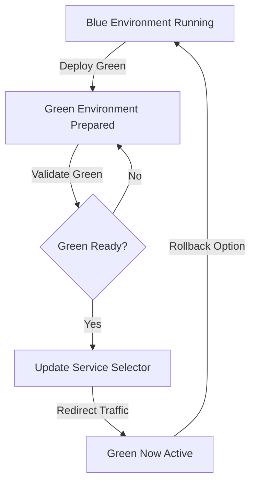
<<<<<<< HEAD

### Flow Explanation
1. Blue environment is initial production
2. Green environment deployed alongside
3. Validate green environment 
4. Update service selector
5. Redirect traffic to green
6. Blue remains as rollback option

## Best Practices
- Implement health checks
- Use resource limits
- Configure monitoring
- Validate before switching
- Maintain rollback strategy


## License
This project is licensed under the MIT License
=======
```mermaid
graph TD
    A[Blue Environment (Active Production)] -->|Deploy Green Version| B[Green Environment (Staging/Idle)]
    B -->|Run Tests & Validate| C{Validation Successful?}
    C -->|Yes| D[Update Service Selector to Green]
    C -->|No| F[Fix Issues and Redeploy Green]
    D -->|Redirect User Traffic| E[Green Environment Active]
    E -->|Keep Blue as Backup| G[Blue Available for Rollback]
    G -->|If Issues Found| A
```
```mermaid
graph TD
    A[Blue Environment 🟦 <br>(Active Production)]:::blue -->|Deploy Green| B[Green Environment 🟩 <br>(Prepared for Release)]:::green
    B -->|Run Tests & Validate| C{Validation Successful?}
    C -->|Yes| D[Update Service Selector <br>to Green Environment]:::green
    C -->|No| F[Fix Issues and Redeploy Green]:::green
    D -->|Redirect Traffic| E[Green Environment Active 🟩]:::green
    E -->|Keep Blue as Rollback Option| G[Blue Environment on Standby 🟦]:::blue
    G -->|If Issues Detected| A

    classDef blue fill:#007bff,color:#fff,stroke:#004080,stroke-width:2px;
    classDef green fill:#28a745,color:#fff,stroke:#1d6d2b,stroke-width:2px;
```

### Flow Explanation
**1. Blue Environment (Active Production)** — The Blue deployment currently serves live user traffic.

**2. Green Environment Deployed** — A new version of the application (Green) is deployed alongside Blue without interrupting current services.

**3. Validation Phase** — The Green environment undergoes automated and manual tests (health checks, integration, load tests) to ensure it’s production-ready.

**4. Service Selector Update** — Once validated, Kubernetes (or load balancer) switches the service selector from Blue to Green.

**5. Traffic Redirection** — Incoming traffic now routes to the Green environment seamlessly, ensuring zero downtime.

**6. Rollback Option** — The Blue environment remains intact temporarily and can be reactivated quickly if issues arise in Green.

### Flow Explanation

**1. Blue Environment (Active Production)** — Initially serves live users.

**2. Green Environment (Prepared)** — A new version of the app is deployed in parallel.

**3. Validation Stage** — The Green version undergoes testing (readiness, integration, performance).

**4. Service Switch** — Kubernetes or the load balancer updates selectors to point to Green.

**5. Traffic Redirection** — User traffic seamlessly shifts to the new environment.

**6. Rollback Safety** — Blue remains as a standby until Green proves stable.


---

## Screenshots
Place screenshots in `/Screenshots` :

**Local Development**
  - Install dependencies
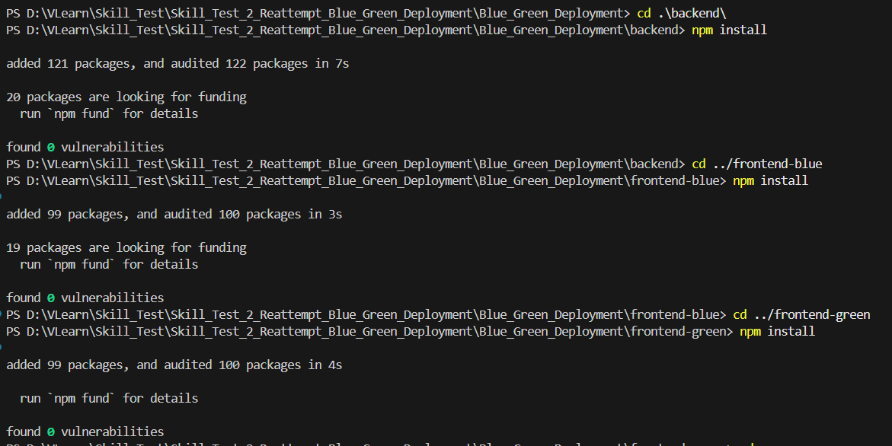
  - Start services locally
    - `backend`
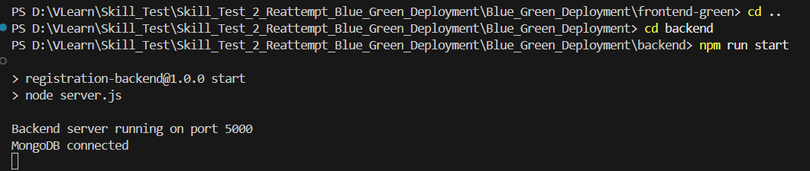
    - `frontend blue`
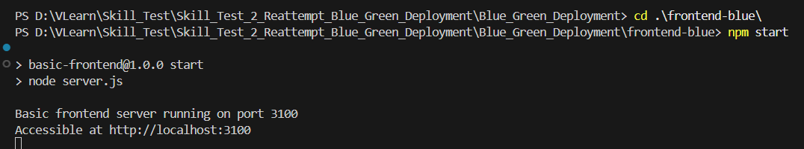
    - `frontend green`
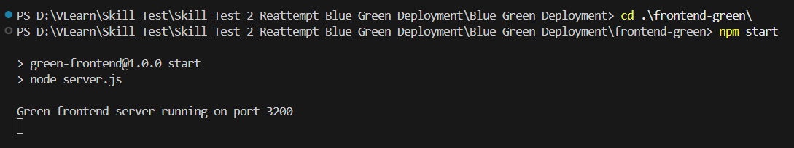
 - Verify health & UI
 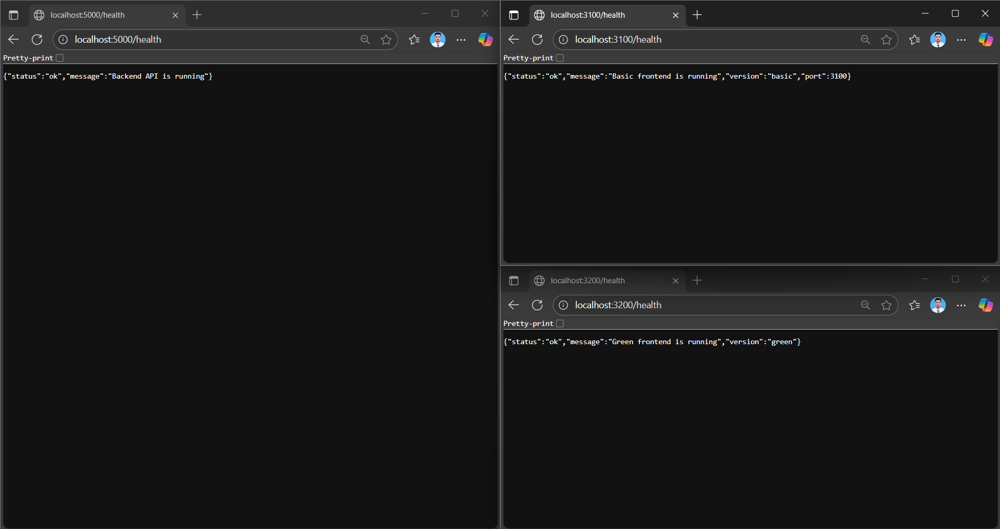
 - Open in browser:
  - `Blue`
 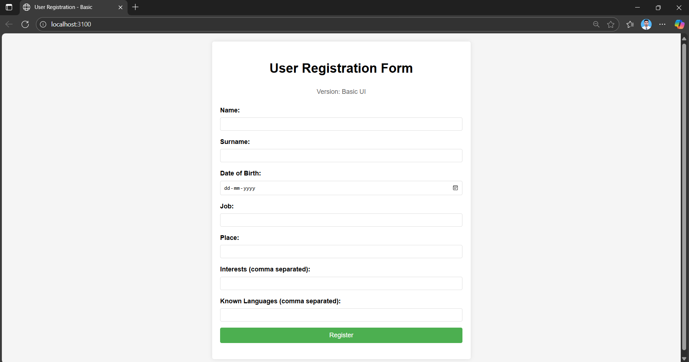
  - `Green`
 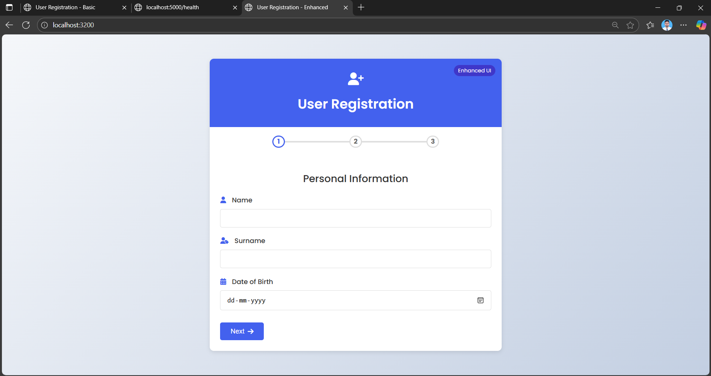

**Docker — Containerization**
  - Creating Docker Container

  - Check Services
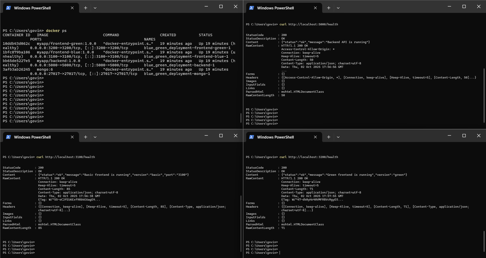
 - Fronent
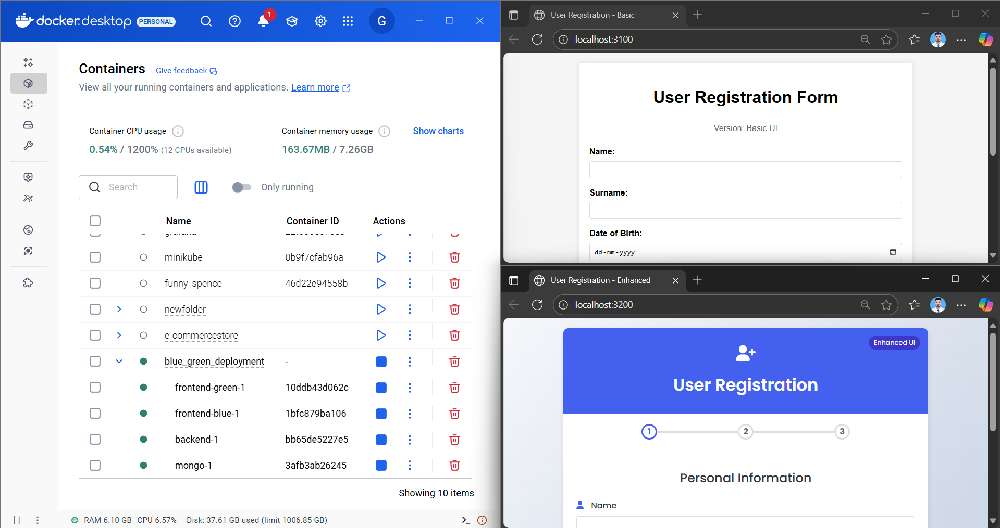
 - Services-Health:
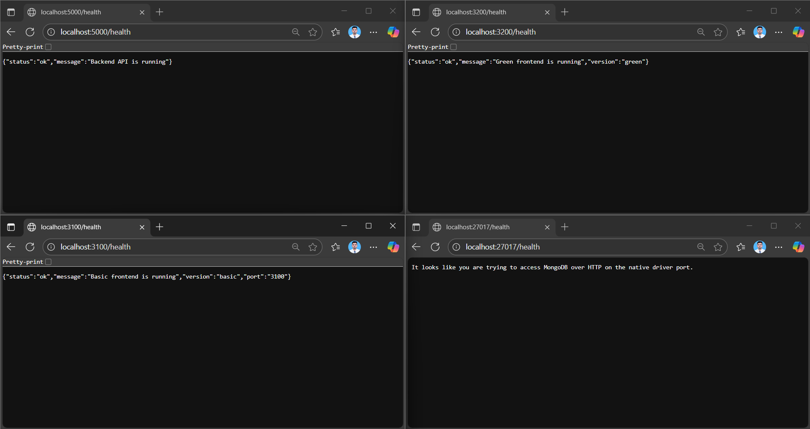

**Kubernetes (Minikube) Deployment**
  - Verify Deployments
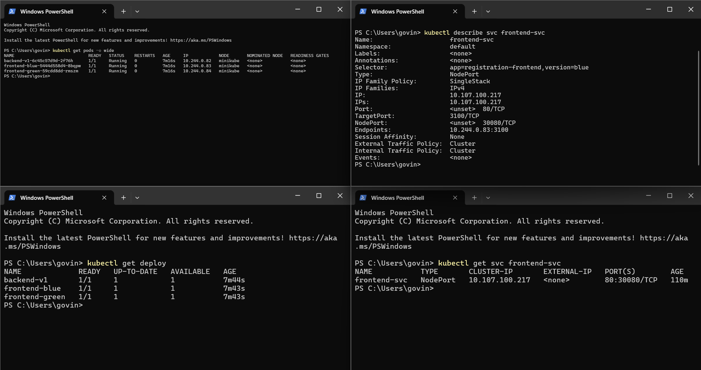
  - Verify Access


**Blue-Green Switching (Kubernetes)**
  - Edit-Service-file
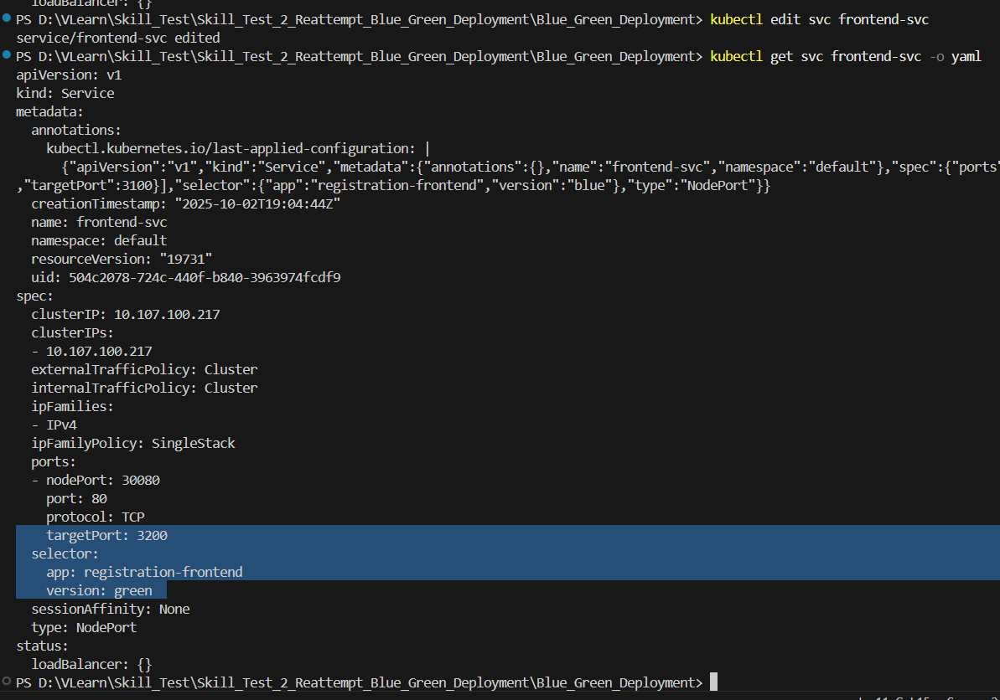
  - Verify Changes (`Green`)
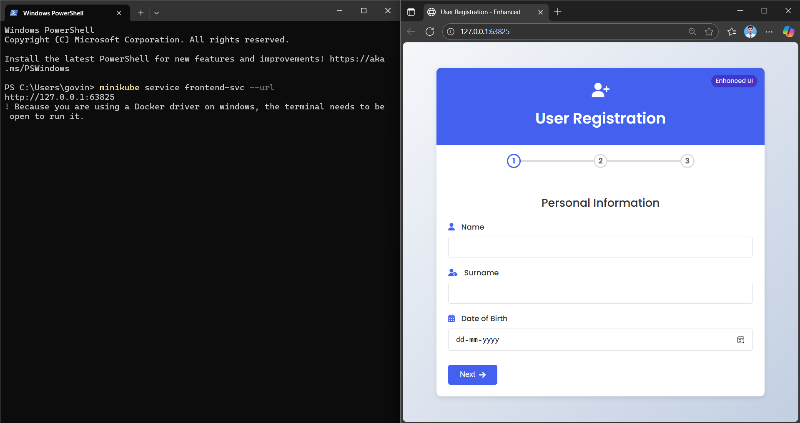
  - Roll Back
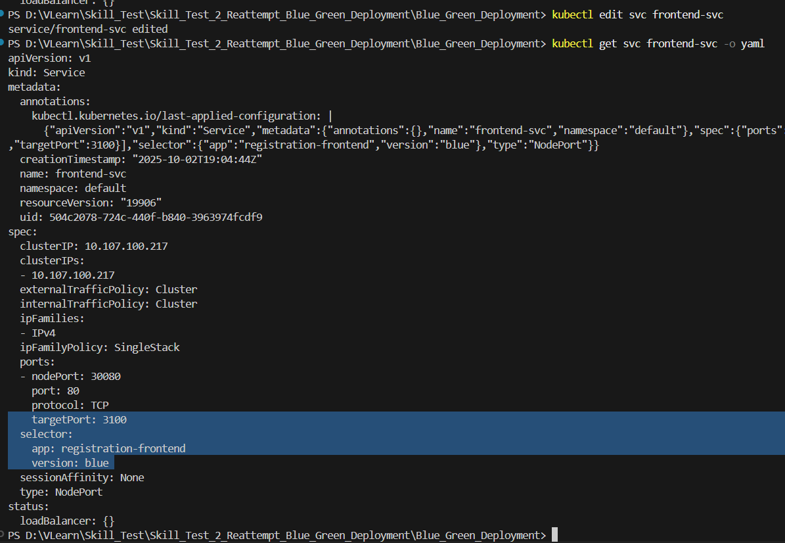
  - Verify Changes (`Blue`)
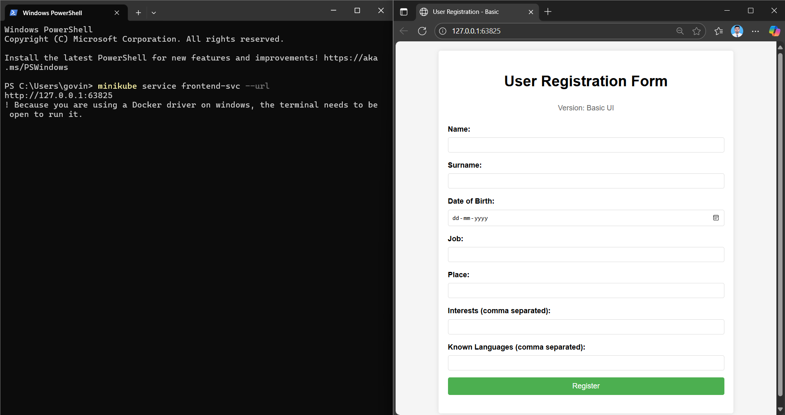

---

## Notes, best practices & security
- Store Mongo credentials in **Kubernetes Secrets**, *not* plain YAML.
- Use resource `requests`/`limits` for every container.
- Prefer Ingress + TLS for production traffic; use LoadBalancer service type when deploying to cloud.
- For gradual traffic shifting use a service mesh (Istio) or an ingress controller supporting weights.
- Monitor and log (Prometheus + Grafana + ELK/EFK).

---

## License
This project is licensed under the MIT License.
>>>>>>> 6952196 (first commit)
