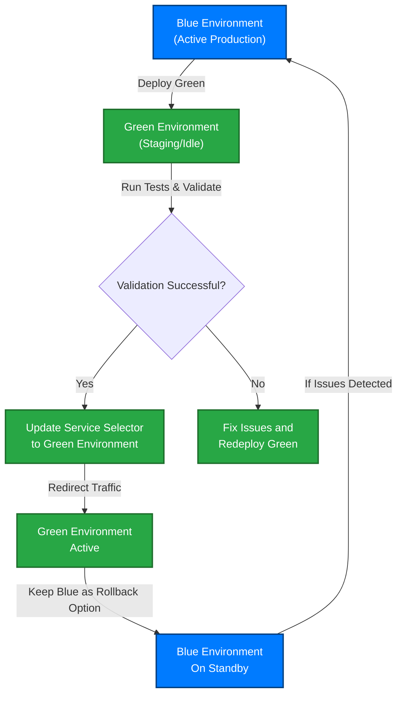
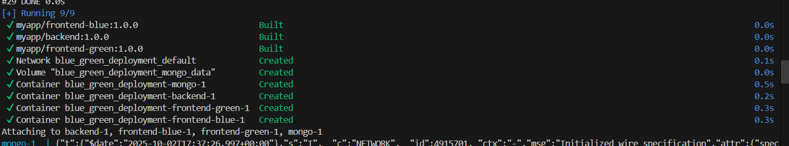

# Blue-Green Deployment — README.md

> A complete guide to run, containerize, and deploy a Node.js registration app with a Blue-Green deployment strategy on Minikube/Kubernetes.

---

## Prerequisites
- Docker Desktop (or Docker)  
- Minikube  
- kubectl (matching your k8s version)  
- Helm (optional for advanced deployments)  
- Node.js (v16+) & npm  
- Git

---

## Repository & Project Structure
This repo contains:
- Backend Express API with MongoDB (`/backend`)
- Two frontends: **Basic** (`/frontend-blue`) and **Enhanced** (`/frontend-green`)
- Dockerfiles for each service
- `docker-compose.yml` for local multi-container dev
- Kubernetes manifests for Minikube (with blue-green switch via Service selector)


Assumes the repo layout (adjust if different):
```
/Blue_Green_Deployment
├─ backend/
│  ├─ Dockerfile
│  ├─ package.json
│  └─ server.js        # listens on PORT (default 5000) and has /health
├─ frontend-blue/
│  ├─ Dockerfile
│  ├─ package.json
│  └─ server.js        # listens on PORT 3100, /health returns version: basic
├─ frontend-green/
│  ├─ Dockerfile
│  ├─ package.json
│  └─ server.js        # listens on PORT 3200, /health returns version: green
├─ docker-compose.yml
├─ k8s/
│  ├─ backend-deployment.yaml
│  ├─ frontend-blue-deployment.yaml
│  ├─ frontend-green-deployment.yaml
│  └─ frontend-service.yaml
└─ README.md
```

---

## Local Development

### 1. Clone the repository
```bash
git clone <your-repository-url>
cd <repo-directory>
```

### 2. Install dependencies
Install dependencies (backend and both frontends)
```bash
# Backend
cd backend
npm install

# Frontend blue
cd ../frontend-blue
npm install

# Frontend green
cd ../frontend-green
npm install

# Return to root
cd ..
```

### 3. Configure MongoDB (backend)
Create `backend/.env`:
```
PORT=5000
MONGO_URI=mongodb://<user>:<pass>@<host>:<port>/<dbname>?authSource=admin
```
> Replace `MONGO_URI` with your MongoDB connection string (local Mongo, replica, or Atlas).

### 4. Start services locally
Open three terminals (or pm2/screen / separate shells):

```bash
# Terminal 1 - backend
cd backend
npm run start        # or npm run dev (nodemon) if you prefer

# Terminal 2 - frontend blue
cd frontend-blue
npm start            # runs the basic frontend (server.js uses PORT 3100 by default)

# Terminal 3 - frontend green
cd frontend-green
npm start            # runs the green frontend (server.js uses PORT 3200 by default)
```

### 5. Verify health & UI
 - Backend health: `http://localhost:5000/health` → should return JSON `{ status: 'ok', message: 'Backend API is running' }`.
 - Frontend blue health: `http://localhost:3100/health` → returns `{ status:'ok', message:'Basic frontend is running', version:'basic', port:3100 }`.
 - Frontend green health: `http://localhost:3200/health` → returns `{ status:'ok', message:'Green frontend is running', version:'green' }`.

Open in browser:
- Blue: `http://localhost:3100`  
- Green: `http://localhost:3200`


> If any service fails:
> - Check console logs.
> - Ensure MONGO_URI is reachable; check backend console for MongoDB connected or error.
> - Confirm ports are free.
---

## Docker — Containerization

Create Dockerfiles in each service folder. A small entrypoint script replaces
the hardcoded backend URL in the frontends with the `BACKEND_URL` env var
at container start.

**Build & run with Docker Compose (dev):**
```bash
docker compose up --build
```
**Services:**
- MongoDB: `localhost:27017`
- Backend: `http://localhost:5000`
- Basic UI: `http://localhost:3100`
- Enhanced UI: `http://localhost:3200`

The Compose file sets `BACKEND_URL=http://localhost:5000/api/users` for both frontends.

**Verify:**
```bash
docker compose ps
curl http://localhost:5000/health
curl http://localhost:3100/health
curl http://localhost:3200/health
```

---

## Kubernetes (Minikube) Deployment

### 1. Start Minikube
**Prereqs:** Minikube + kubectl. Start Minikube and set Docker env so images are locally available to cluster:
```bash
minikube start
```

### 2. Create Kubernetes Manifest Files (put in `k8s/`)

```
/Blue_Green_Deployment
├─ k8s/
   ├─ backend-deployment.yaml
   ├─ frontend-blue-deployment.yaml
   ├─ frontend-green-deployment.yaml
   └─ frontend-service.yaml
```
> #### Service File Key Concepts
> Your `frontend-service.yaml` should:
> - Use selector to route traffic
> - Define version (blue/green)
> - Map ports correctly

### 3. Apply all manifests
```bash
kubectl apply -f k8s/
```

### 4. Verify deployments & access
```bash
kubectl get pods -o wide
kubectl get deploy
kubectl get svc frontend-svc
kubectl describe svc frontend-svc

# Test forwarding to the service (Minikube)
minikube service frontend-svc --url   # prints reachable URL
# test:
curl <url>/health
```

---

## Blue-Green Switching (Kubernetes)

### Strategy
- Keep both `frontend-blue` and `frontend-green` running.
- A single `frontend-svc` Service controls which version receives traffic via its selector (`version: blue|green`) and `targetPort`.
- Switch traffic by updating the Service selector (atomic).

### Quick patch (JSON patch) — *works in most shells*
> **Linux/macOS (bash)**:
```bash
# Switch to Green frontend (targetPort 3200)
kubectl patch service frontend-svc -p '{ "spec": { "selector": { "app": "registration-frontend", "version": "green" }, "ports": [ { "port": 80, "targetPort": 3200, "nodePort": 30080, "protocol": "TCP" } ] }}'

# Switch back to Blue frontend (targetPort 3100)
kubectl patch service frontend-svc -p '{ "spec": { "selector": { "app": "registration-frontend", "version": "blue" }, "ports": [ { "port": 80, "targetPort": 3100, "nodePort": 30080, "protocol": "TCP" } ] }}'
```

> **Windows PowerShell** — quoting/escaping is tricky. Use `kubectl apply -f` with a temp yaml file or use `kubectl patch` with `--patch` and proper escaping:
```powershell
# Green frontend (targetPort 3200)
kubectl patch service frontend-svc -p '{
  "spec": {
    "selector": {
      "app": "registration-frontend",
      "version": "green"
    },
    "ports": [
      {
        "port": 80,
        "targetPort": 3200,
        "nodePort": 30080,
        "protocol": "TCP"
      }
    ]
  }
}'

#  Blue frontend (targetPort 3100)

kubectl patch service frontend-svc -p '{
  "spec": {
    "selector": {
      "app": "registration-frontend",
      "version": "blue"
    },
    "ports": [
      {
        "port": 80,
        "targetPort": 3100,
        "nodePort": 30080,
        "protocol": "TCP"
      }
    ]
  }
}'
```

### Alternative: edit & apply the YAML
```bash
kubectl edit svc frontend-svc
# change `selector.version` to "green" and `ports[0].targetPort` to 3200, save & exit
```

### Verify the switch
```bash
kubectl get svc frontend-svc -o yaml

minikube service frontend-svc --url   # prints reachable URL

curl <url>/health    # should return green's health json
```
>  - Open in browser → now you should see frontend-green. ✅

#### How it works
 - `selector.version` → switches traffic between blue/green pods.
 - `ports.targetPort` → updates which container port NodePort maps to.
 - `nodePort` stays the same (`30080`) so the external URL doesn’t change.

---

## Health checks & Probes
- **Readiness probe** ensures a pod is added to Endpoints only when ready — *critical* before switching traffic.
- **Liveness probe** ensures Kubernetes restarts deadlocked containers.
- Configure `initialDelaySeconds` to account for DB connections or migrations.

Example readiness/liveness used above: HTTP `/health` on proper container port.

---

## Troubleshooting & Common Issues

- **Patch command fails in PowerShell** — use file-based patch or `kubectl edit`.
- **Service still serving old version** — check `kubectl get endpoints frontend-svc`.
- **Pod failing readiness** — inspect logs `kubectl logs <pod>` and `kubectl describe pod <pod>`.
- **Minikube not showing service** — `minikube service frontend-svc --url` or `minikube ip` + NodePort.
- **ImagePullBackOff** — ensure images exist in accessible registry or build inside minikube Docker daemon.
- **Mongo connectivity issues** — verify `MONGO_URI`, network policy, or run Mongo as a k8s StatefulSet.

---

## Cleanup
```bash
kubectl delete -f k8s/
minikube stop
# Optional: remove local images
docker image rm registration-backend:1.0 registration-frontend-blue:1.0 registration-frontend-green:1.0
```

---

## Diagram



### Flow Explanation
**1. Blue Environment (Active Production)** — The Blue deployment currently serves live user traffic.

**2. Green Environment Deployed** — A new version of the application (Green) is deployed alongside Blue without interrupting current services.

**3. Validation Phase** — The Green environment undergoes automated and manual tests (health checks, integration, load tests) to ensure it’s production-ready.

**4. Service Selector Update** — Once validated, Kubernetes (or load balancer) switches the service selector from Blue to Green.

**5. Traffic Redirection** — Incoming traffic now routes to the Green environment seamlessly, ensuring zero downtime.

**6. Rollback Option** — The Blue environment remains intact temporarily and can be reactivated quickly if issues arise in Green.


---

## Screenshots
Place screenshots in `/Screenshots` :

**Local Development**
  - Install dependencies

  - Start services locally
    - `backend`

    - `frontend blue`

    - `frontend green`

 - Verify health & UI
 
 - Open in browser:
  - `Blue`
 
  - `Green`
 

**Docker — Containerization**
  - Creating Docker Container

  - Check Services

 - Frontend

 - Services-Health:


**Kubernetes (Minikube) Deployment**
  - Verify Deployments

  - Verify Access


**Blue-Green Switching (Kubernetes)**
  - Edit-Service-file

  - Verify Changes (`Green`)

  - Roll Back

  - Verify Changes (`Blue`)


---

## Notes, best practices & security
- Store Mongo credentials in **Kubernetes Secrets**, *not* plain YAML.
- Use resource `requests`/`limits` for every container.
- Prefer Ingress + TLS for production traffic; use LoadBalancer service type when deploying to cloud.
- For gradual traffic shifting use a service mesh (Istio) or an ingress controller supporting weights.
- Monitor and log (Prometheus + Grafana + ELK/EFK).

---

## License
This project is licensed under the MIT License.
